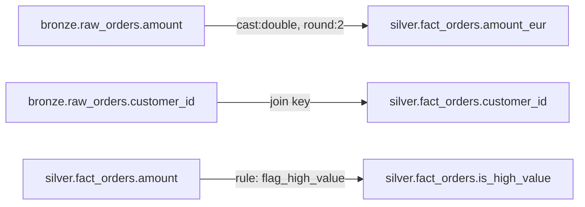

# Piste 3 — Lineage & dictionnaire de donnees

> Priorite : 2/5 — Repond au besoin le plus frequent du marche, valorise les YAML existants.
> Statut : Reflexion initiale (21 avril 2026)

---

## Probleme adresse

La question la plus recurrente en data engineering :
**"D'ou provient ce champ ? Quelle table source ? Quelle transformation ?"**

Skifer a deja la plupart des briques pour y repondre.

---

## Ce qui existe deja

| Module | Contribution au lineage |
|---|---|
| **SemanticEngine** | Modeles YAML avec `source_table`, `dimensions`, `metrics` (definitions SQL) |
| **QueryResolver** | Sait quels noms viennent de quel modele YAML, leve des erreurs si un nom est inconnu |
| **SemanticBuilder** | Genere des YAML a partir du schema Spark |
| **GlossaryReader** | Peut lire des definitions metier depuis JSON/YAML/TXT/PDF/PPTX |
| **NotebookExtractor + RuleInspector** | Extraient les metadonnees des notebooks et des regles |

---

## Architecture proposee

```
skifer/
  lineage/
    tracker.py       # LineageTracker — construit le graphe a partir des YAML schemas
    dictionary.py    # DataDictionary — definition, type, source, transformations d'un champ
    renderer.py      # Genere la visualisation (Mermaid, D3, ou export JSON pour le client graphique)
    sampler.py       # Distinct sampling : echantillonne les valeurs distinctes d'un champ
```

---

## LineageTracker — comment ca marche

Le lineage peut etre derive **statiquement** des YAML sans executer Spark :

### Sources de lineage

1. **select_final** : chaque entree `[source_col, target_col, [ops]]` cree un edge
   `source_table.source_col --[ops]--> target_table.target_col`.

2. **join** : chaque join cree un edge entre les cles de jointure.

3. **business_rules** : plus delicat — les regles sont du code Python arbitraire. Deux options :
   - **Analyse statique** via `ast.parse()` sur la fonction pour extraire les `withColumn` / `col()`.
   - **Convention** : les regles enregistrees declarent leurs inputs/outputs dans un decorateur enrichi :
     ```python
     @RuleRegistry.register_rule(inputs=["amount"], outputs=["is_high_value"])
     def flag_high_value(df):
         return df.withColumn("is_high_value", F.when(F.col("amount") >= 1000, 1).otherwise(0))
     ```

4. **Semantic models** : les metrics SQL contiennent les references aux colonnes source.

### Structure du graphe

```python
@dataclass
class LineageEdge:
    source_table: str
    source_column: str
    target_table: str
    target_column: str
    transformations: list[str]   # ex: ["cast:double", "round:2"]
    edge_type: str               # "select", "join", "rule", "metric"
```

Le graphe est un DAG (Directed Acyclic Graph) navigable en avant (impact analysis) et en arriere (provenance).

---

## DataDictionary — structure d'une entree

```python
@dataclass
class FieldEntry:
    name: str                      # nom du champ
    table: str                     # table d'appartenance
    type: str                      # type Spark/SQL
    description: str               # definition metier (du glossaire ou du YAML)
    source_fields: list[str]       # champs source (lineage direct)
    transformations: list[str]     # operations appliquees
    distinct_sample: list[Any]     # N valeurs distinctes echantillonnees
    last_sampled: datetime         # date du dernier sampling
```

### Integration avec le glossaire

Le `GlossaryReader` existant alimente le champ `description` du dictionnaire. Si un terme du glossaire match un nom de champ (fuzzy matching via `difflib.get_close_matches` deja utilise dans le `QueryResolver`), la definition est automatiquement associee.

---

## Sampling

```python
def sample_distinct(spark, fqn: str, column: str, limit: int = 50) -> list:
    """Retourne les N premieres valeurs distinctes d'un champ."""
    return [row[0] for row in
            spark.table(fqn).select(column).distinct().limit(limit).collect()]
```

Le sampling est la **seule partie qui necessite un backend** (Spark ou autre). Le reste du lineage et du dictionnaire est purement statique (parsing YAML).

---

## Visualisation du lineage

### Formats de sortie

| Format | Usage |
|---|---|
| **Mermaid** | Rendu markdown dans GitHub, notebooks, documentation |
| **JSON** | Consomme par le client graphique (piste 2) ou des outils tiers |
| **D3.js** | Visualisation interactive standalone (HTML) |

### Exemple de rendu Mermaid



---

## Dependances avec les autres pistes

| Piste | Impact |
|---|---|
| Piste 1 (Multi-plateforme) | Le sampling necessite le backend abstrait. Le reste est independant |
| Piste 2 (Client graphique) | Le client consomme le JSON du lineage pour l'affichage visuel |
| Piste 4 (Hub agentic) | Le `LineageAgent` et le `DictionaryAgent` consomment directement le `LineageTracker` et le `DataDictionary` |
| Piste 5 (Observabilite) | Le lineage enrichit les rapports d'observabilite (impact d'une anomalie) |
