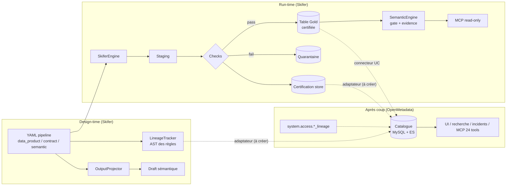

# Benchmark — OpenMetadata vs Skifer

> Analyse comparative rédigée le 7 septembre 2026, à partir de la documentation officielle d'OpenMetadata
> (version courante 2.0.1 du 2 septembre 2026) et de l'état du dépôt Skifer sur la branche
> `plan-29-feat-07` (Feature 7 MCP en cours, slice 7.3 non commitée).
> Ce document n'est pas un plan : il sert de base pour décider si et comment un « Plan 30 — adaptateur
> OpenMetadata » doit exister.

---

## 1. Résumé exécutif

**Les deux produits ne sont pas de la même catégorie, et c'est la conclusion la plus importante.**

- **OpenMetadata** est un *catalogue / couche de contexte* : il **observe** un système de données existant
  (connecteurs, logs de requêtes, manifests dbt, événements OpenLineage), stocke les métadonnées dans une
  base centrale (MySQL/Postgres + Elasticsearch), et les expose (UI, REST, SDK, MCP). Il **n'exécute jamais**
  un pipeline, ne compile pas de SQL métier, n'évalue pas une métrique et ne bloque pas une écriture.
- **Skifer** est un *moteur d'exécution déclaratif + couche sémantique gouvernée* : il **produit**
  les tables (Bronze → Silver → Gold), applique les contrats **côté compute** (staging → quarantaine →
  promotion), compile et exécute des requêtes sémantiques, et produit des preuves. Il n'a **aucun** store de
  métadonnées persistant hors qualité et certification, aucune UI, aucune recherche, aucun connecteur
  hors Spark/Databricks.

Le recouvrement fonctionnel réel est d'environ un tiers du périmètre de chacun : lineage, qualité,
contrats, data products, glossaire/dictionnaire, MCP. Sur ce recouvrement, les deux outils traitent le même
objet à des moments différents du cycle de vie : **Skifer le fabrique au design-time et l'applique au
run-time ; OpenMetadata le catalogue et le rend découvrable après coup.**

**Recommandation** : ne pas reconstruire un catalogue dans Skifer. Positionner Skifer comme **producteur de
métadonnées « à la source »** (le YAML est la vérité) et OpenMetadata comme **miroir de découverte et de
gouvernance transverse**. Concrètement :

1. **Maintenant** — combler cinq trous internes de Skifer mis en évidence par la comparaison, indépendamment
   d'OpenMetadata : persistance du lineage, taxonomie de classification, modèle d'ownership, cycle de vie
   des contrats (statut, SLA), cycle de vie des incidents qualité.
2. **Ensuite** — un adaptateur optionnel `[openmetadata]` non bloquant, sur le modèle exact de
   `uc_mirror.py` : tables, lineage colonne, résultats de checks, contrats ODCS, data products,
   certification.
3. **Plus tard** — la direction inverse (glossaire, ownership et tags PII lus depuis OpenMetadata) et une
   coexistence des deux serveurs MCP côté agents : OpenMetadata pour la découverte, Skifer pour l'exécution
   gouvernée.

---

## 2. Fiche d'identité comparée

| Axe | OpenMetadata | Skifer |
|---|---|---|
| Nature | Catalogue / « Open Context Layer for Data and AI » (rebranding 2.0) | Framework de data engineering déclaratif + couche sémantique agent-ready |
| Licence | Apache 2.0 (cœur) ; **AI SDK sous Collate Community License 1.0**, non OSI | Non encore open-source (juridique en cours) |
| Gouvernance | Mono-éditeur (Collate Inc.), membre Silver de la Linux Foundation depuis mars 2026 ; **pas** un projet hébergé LF AI & Data | Équipe interne |
| Maturité | ~15,1 k étoiles, ~2,4 k forks, release mineure tous les ~2 mois, 2.0.0 le 24 août 2026 | 2.0.0 le 3 août 2026, Plan 29 à 34/53 slices |
| Stack | Java 21 / Dropwizard, MySQL ≥ 8.0.42 ou PostgreSQL ≥ 15, Elasticsearch 9 ou OpenSearch 3, React, ingestion Python 3.10–3.12, Airflow optionnel depuis 1.12 (orchestrateur Kubernetes natif), graphe RDF Jena depuis 1.13 | Python, PySpark/Delta, Databricks (Unity Catalog, SQL warehouse), SQLite en local |
| Déploiement | Docker Compose, Helm (EKS/AKS/GKE), bare metal, SaaS Collate | `pip install`, notebook Databricks ou local ; zéro service à opérer |
| Modèle de données | JSON Schema unique (openmetadatastandards.org), types générés Java/Python/TS, versioning + `ChangeEvent` sur chaque entité | YAML de pipeline + YAML sémantique + registre Python ; IR interne (`core/ir.py`) |
| Cible | Toute l'entreprise, multi-sources (~96 connecteurs listés, « 130+ » revendiqués) | Une plateforme Spark/Databricks, choix assumé du Plan 26 |

---

## 3. Positionnement dans le cycle de vie

OpenMetadata voit une table Skifer de deux façons aujourd'hui, **sans aucun code Skifer** : le connecteur Unity
Catalog (métadonnées, profiler, tags, propriétaires) et les tables système `system.access.table_lineage`
/ `column_lineage` (lineage réel, issu des requêtes exécutées). Ce que ce chemin ne voit **pas** : le
lineage de design (avant tout run), les règles Python, les contrats, les résultats des checks Skifer, la
certification, les data products et le modèle sémantique.

---

## 4. Comparaison domaine par domaine

### 4.1 Lineage

| | OpenMetadata | Skifer |
|---|---|---|
| Granularité | Table + colonne | Colonne (`LineageEdge`, `edge_type ∈ {select, join, rule, metric}`) |
| Sources | Parsing de logs de requêtes (`sqllineage`), définitions de vues, manifest dbt, connecteurs pipeline, backend Airflow, événements **OpenLineage** (Kafka/Kinesis), édition manuelle, API `/lineage` | Analyse statique du YAML (IR) + **AST des règles Python** (`RuleAnalyzer`) + regex sur le SQL sémantique |
| Moment | Après exécution (run-time observé) | **Avant** toute exécution (design-time, sans Spark) |
| Persistance | Store central versionné, analyse d'impact upstream/downstream avec export CSV/PNG | **Aucune** : recalculé à la demande par `build_lineage()`, jeté ensuite |
| Export | UI, API, Impact Analysis | Mermaid, JSON, HTML statique |

**Lecture.** Skifer a une information qu'OpenMetadata ne peut pas obtenir seul : le lineage *intentionnel*,
disponible dans la PR, y compris à travers des règles Python. OpenMetadata a ce que Skifer n'a pas : la
persistance, l'historique et le lineage *observé* (ce qui a vraiment tourné, y compris les lectures faites
hors Skifer). Les deux sont complémentaires, pas concurrents. Le trou côté Skifer est la persistance : un lineage
jeté après calcul ne peut alimenter ni une analyse d'impact ni un miroir.

### 4.2 Qualité et observabilité

| | OpenMetadata | Skifer |
|---|---|---|
| Checks | Profiler + test definitions / test cases / test suites ; bibliothèque paramétrée (1.12) ; `tableDiff` cross-DB ; « Data Quality as Code » avec `DataFrameValidator` (1.11) | 11 classes dans `observability/checks.py` (Null, Unique, Type, FilterInvariant, Freshness, LoadFreshness, Volume, VolumeVariation, SchemaDrift, CustomSql) + dérivation automatique depuis le YAML (`ContractExtractor`) |
| Exécution | Pipelines d'ingestion planifiés, hors du pipeline de données | **Dans** le pipeline, sur le staging, avant promotion |
| Historique | Store central, résultats horodatés, breakdown par dimension | `SqliteHistoryStore` / `DeltaHistoryStore` (JSON par rapport) |
| Incidents | **Incident Manager** : New → Ack → Assigned → Resolved avec cause racine, ouverture automatique sur échec | Aucun objet incident ; un échec = quarantaine + rapport |
| Alertes | Email, Slack, MS Teams, Google Chat, webhook, propriétaires ; **propagation par lineage** aux owners aval (1.10) | Webhook, Slack, SMTP (`AlertDispatcher`) |
| Résultats externes | `PUT /dataQuality/testCases/{fqn}/testCaseResult`, intégration Great Expectations native | Pas de push sortant |

**Lecture.** Skifer est plus fort sur le *quand* (le check bloque la publication) ; OpenMetadata est plus fort
sur le *après* (incident, assignation, cause racine, propagation aux consommateurs). La dérivation
automatique des checks depuis `drop_nulls_in` / `drop_duplicates_on` / `filter` / `cast` n'a pas
d'équivalent chez OpenMetadata, où chaque test est déclaré.

### 4.3 Contrats de données

| | OpenMetadata | Skifer |
|---|---|---|
| Objet | Entité `DataContract` (API 1.8, UI 1.9) : `schema`, `semantics`, `qualityExpectations`, `sla` (refreshFrequency, maxLatency, availabilityTime, retention), `security` (dataClassification, rowFilters), `termsOfUse`, `entityStatus` Draft/Active/Deprecated, `reviewers`, `effectiveFrom/Until`, `latestResult` | Bloc `contract:` : `grain`, `output.{logical_type, required, unique, classification, entity, description}` ; `ContractDefinition` canonicalisée + hash SHA-256 |
| Validation | Quotidienne ou à la demande, **dans le catalogue** ; ne bloque rien côté entrepôt | **Au run**, sur le staging ; échec = quarantaine, jamais de table Gold non conforme |
| ODCS 3.1 | Import (merge/replace) et export (1.12) | **Export uniquement** (`export_odcs_31`, appelé nulle part dans `src/`) |
| Cycle de vie | Statut, reviewers, dates d'effet, approbation | Versions semver append-only ; **pas** de statut, de reviewer, de dépréciation |

**Lecture.** Le cœur de Skifer (le contrat *appliqué*) est un vrai différenciateur. Mais le contrat Skifer
est un objet de compute, pas un objet de gouvernance : il ne dit pas *qui* le révise, *jusqu'à quand* il
vaut, *quel SLA* de fraîcheur il promet ni *quelle politique de sécurité* s'applique. Ce sont précisément les
champs qu'un consommateur ou un auditeur demande.

### 4.4 Data products, domaines, ownership

| | OpenMetadata | Skifer |
|---|---|---|
| Data product | Entité avec ports d'entrée/sortie (aligné ODPS), owners/experts/reviewers, multi-domaines (1.9), approbation sur changement de port | Bloc `data_product: {id, version, owner, description}` |
| Domaines | Domaines et sous-domaines, Data Marketplace (1.13) | Aucun |
| Ownership | Multi-propriétaires, hiérarchie d'équipes à 5 niveaux, seuls les groupes possèdent des assets | `owner` = une chaîne libre, exclue du hash de contrat |
| Tiers / certification | Classifications `Tier`, `Certification` intégrées ; workflows de certification (1.6) | Certification **calculée** depuis les checks critiques, miroir de 4 tags UC |

**Lecture.** Skifer a la bonne *sémantique* de certification (un statut dérivé de faits, pas déclaré) mais un
modèle organisationnel inexistant. Ce n'est pas un problème tant que la vérité organisationnelle vit
ailleurs (Unity Catalog, OpenMetadata) ; ça le devient dès que Skifer doit router une alerte, exiger une
approbation (Feature 9) ou publier un contrat.

### 4.5 Glossaire, dictionnaire, classification

| | OpenMetadata | Skifer |
|---|---|---|
| Glossaire | Objet de première classe : termes hiérarchiques, synonymes, relations typées (1.13 : broader/narrower/calculated from), reviewers, statut Draft/Approved, import CSV, ontologie OWL (2.0) | `GlossaryReader` renvoie du **texte brut** (JSON/YAML/TXT/PDF/PPTX) pour un prompt LLM ; `DataDictionary` = `FieldEntry(name, table, description, source_fields, transformations)` sans type ni classification |
| Classification | Classifications PII / PersonalData / Tier, options mutuellement exclusives, **auto-classification** (regex + NER sur échantillon, seuil 80) | `classification` = chaîne libre non validée, **sans aucun comportement aval** (pas de masquage, pas de propagation) |
| Rattachement terme ↔ colonne | Persisté, versionné | Fuzzy-match `difflib` à 0,8 à la volée, jamais stocké |

**Lecture.** C'est le domaine où Skifer est le plus loin derrière, et c'est normal : le glossaire est un
objet transverse d'entreprise, pas un objet de pipeline. En revanche, une taxonomie minimale de
classification (enum + propagation via lineage) est nécessaire à Skifer pour lui-même : le `security` d'un
contrat, la redaction des preuves et la policy MCP en dépendent.

### 4.6 Couche sémantique et métriques

| | OpenMetadata | Skifer |
|---|---|---|
| Métriques | Entité `Metric` (1.6) : expression SQL/Python/LaTeX, granularité, unité, métriques liées, lineage. **Documentaire uniquement, rien ne l'évalue** | Modèles sémantiques exécutables : `QueryResolver` (SQL déterministe depuis des noms), `SemanticPlanner` (chemins de jointure, sécurité de grain/fanout, additivité), calendriers versionnés, `SemanticEngine.query()` |
| NL → requête | **Collate uniquement** (MetaPilot / AskCollate, SQL Studio) ; l'OSS n'a que la recherche sémantique | `GenBIAgent` OSS-interne : 2 étapes LLM, jamais de SQL émis par le LLM |
| Génération depuis le pipeline | Aucune | `OutputProjector` → draft sémantique dans la même PR, merge trois voies |

**Lecture.** Aucun recouvrement réel. OpenMetadata *décrit* une métrique ; Skifer la *calcule* avec des
garanties de grain. Une métrique Skifer pourrait être poussée comme entité `Metric` OpenMetadata (expression =
SQL compilé, lineage = sous-graphe) pour être découvrable, sans jamais qu'OpenMetadata devienne la source.

### 4.7 MCP et agents

| | OpenMetadata | Skifer (Feature 7) |
|---|---|---|
| Serveur | Dans le serveur Java, `/mcp`, Streamable HTTP, activé par défaut en 2.0 | Processus Python séparé, extra `[mcp]`, transport à venir (7.4) |
| Surface | **24 outils** dont 11 en **écriture** (`create_lineage`, `create_test_case`, `create_glossary_term`, `create_data_product`, `patch_entity` en JSON Patch…) | **1 outil** fermé `query_semantic_model` (schéma JSON strict, 10 opérateurs, ≤ 1 000 lignes) + resources read-only (catalogue, modèles, contrats, certification, lineage) |
| Auth | OAuth 2.0, PAT, JWT bot ; mêmes policies RBAC que le REST | `RequestContext(subject, scopes)` fourni par l'appelant ; scopes `models:read` / `contracts:read` / `lineage:read` / `query:execute` ; découverte filtrée par scope ; auth déléguée = 7.4 |
| Ce que l'agent obtient | Contexte (description, owners, lineage, incidents, mémoires) | **Des données** gouvernées (gate de certification, preuve, redaction) |

**Lecture.** Deux modèles de menace opposés. OpenMetadata donne à l'agent une surface large, y compris
d'écriture, sous RBAC. Skifer donne une surface minuscule et fail-closed. Ils sont complémentaires côté agent :
OpenMetadata répond à « qu'est-ce qui existe, qui le possède, est-ce fiable ? », Skifer répond à « donne-moi le
chiffre, prouve-le ». **Point d'attention** : `patch_entity` côté OpenMetadata permet à un agent de réécrire
une description ou un tag qu'Skifer considère comme dérivé du YAML ; il faut fixer, champ par champ, qui est
la source de vérité (voir §7).

### 4.8 Sécurité et accès

| | OpenMetadata | Skifer |
|---|---|---|
| Identité | SSO Google/Okta/Auth0/Azure/Cognito/OneLogin/Keycloak/OIDC ; SCIM Collate-only | Aucune ; identité déléguée prévue en 7.4 et 9.5 |
| Autorisation | RBAC + ABAC (ressources × opérations × conditions), rôles par défaut, RBAC sur la recherche | Scopes exacts sur `RequestContext` ; policy de certification par classe de consommateur ; override break-glass borné 4 h |
| Audit | Journaux d'audit utilisateur et IA (1.12), `ChangeEvent` par entité | Tracing OTel/MLflow allowlisté, `run_id` de bout en bout, preuves sémantiques |

**Lecture.** Skifer n'a pas d'IAM et ne doit pas en construire un. Il a en revanche une chose qu'OpenMetadata
n'a pas : une *policy de données* (certifié ou non pour cette classe de consommateur) évaluée à l'exécution.

### 4.9 Recherche, UI, collaboration, connecteurs, insights

Hors périmètre Skifer, par conception (Plan 26 et roadmap « client graphique » gelée). OpenMetadata fournit :
recherche hybride mot-clé + vecteur (1.12–1.13), colonnes indexées comme assets, fil d'activité, tâches,
annonces, ~96 connecteurs (Databricks et Unity Catalog en PROD avec profiler, DQ, dbt, tags, owners,
auto-classification), Data Insights (couverture description/ownership/tier), analyse de coût (Snowflake
seulement). **Rien de tout cela ne doit être reconstruit.** Un seul point mérite un équivalent léger côté
Skifer : une commande d'audit de couverture sur les YAML (combien de tables Gold ont un `data_product`, un
`contract`, une description par champ), qui est un calcul pur sur les fichiers.

### 4.10 Tracing, preuves, audit

OpenMetadata journalise des *événements de catalogue*. Skifer journalise des *preuves d'exécution* : hash du
SQL réellement exécuté, hashs de définition des métriques, snapshot de certification, décision de policy,
statut d'exécution, sous-graphe de lineage restreint. OpenMetadata n'a pas d'équivalent et n'en aura pas :
c'est un objet qui n'existe qu'à l'endroit où la requête tourne.

---

## 5. Ce qui manque à Skifer (importable d'OpenMetadata)

Classé par valeur pour Skifer *lui-même*, indépendamment d'une intégration.

| # | Manque | État actuel dans Skifer | Ce qu'OpenMetadata montre | Effort | Rattachement Plan 29 |
|---|---|---|---|---|---|
| 1 | **Persistance du lineage** | `LineageGraph` recalculé et jeté ; aucune table | Store versionné, impact analysis | Moyen : table `_skifer_lineage` Delta/SQLite indexée sur `target_fqn` + `definition_hash`, écrite par `PublicationCoordinator` | Prérequis de l'adaptateur ; enrichit Feature 8 (relations manquantes) |
| 2 | **Taxonomie de classification** | Chaîne libre, aucun effet | Classifications PII/PersonalData/Tier, exclusivité, auto-classification | Faible : enum validé au load (`public`, `internal`, `confidential`, `pii`…), propagation le long des `LineageEdge`, exposition dans la preuve et l'ODCS | Feature 4 (redaction), Feature 7 (scope par classification), Feature 9 |
| 3 | **Modèle d'ownership** | `owner` chaîne libre | Multi-owners, équipes, domaines, reviewers | Faible : `owner` → `{team, steward, domain, contact}` avec rétrocompat chaîne | Feature 9 (approbation), alertes |
| 4 | **Cycle de vie du contrat** | Versions semver, hash | `entityStatus` Draft/Active/Deprecated, `reviewers`, `effectiveFrom/Until`, **`sla`**, **`security`**, `termsOfUse` | Moyen : `contract.status`, `contract.sla.{refresh_frequency, max_latency}` (branché sur `LoadFreshnessCheck`), `contract.security` ; export ODCS complété (aujourd'hui `slaProperties` vide) | Feature 2 |
| 5 | **Cycle de vie des incidents** | Échec = quarantaine + rapport | Incident New → Ack → Assigned → Resolved, cause racine | Moyen : table `incidents` dans le certification store, ouverture automatique, CLI `skifer incidents` | Feature 1/2 |
| 6 | **Import ODCS** | Export seul | Import merge/replace | Faible : `import_odcs_31()` → bloc `contract:` ; permet d'accepter un contrat rédigé côté catalogue | Feature 2 |
| 7 | **Détection de changement entre versions** | Hash de définition (identique / différent) | `ChangeEvent` champ par champ, alertes sur schema change | Faible : diff structuré entre deux `ContractDefinition` (champ ajouté/retiré/retypé) → alerte + entrée d'historique | Feature 2, alertes |
| 8 | **Propagation d'alerte par lineage** | Alerte sur la table en échec seulement | Notification des owners aval | Moyen, dépend de 1 et 3 | Alertes |
| 9 | **Glossaire structuré** | Texte brut pour prompt | Termes, synonymes, relations, statut | Élevé si natif ; **faible si lu depuis OpenMetadata ou Unity Catalog** | Ne pas construire en natif |
| 10 | **Canaux d'alerte** | Webhook, Slack, SMTP | + MS Teams, Google Chat | Trivial | — |
| 11 | **Audit de couverture** | Aucun | Data Insights KPIs | Faible : `skifer audit` sur les YAML | — |
| 12 | **Lineage observé** | Aucun | Tables système UC, OpenLineage | Optionnel : déjà noté comme enrichissement Feature 8, jamais dépendance | Feature 8 |

Non retenus, par conception : UI, recherche, connecteurs multi-sources, IAM/SSO, workflows BPMN.

---

## 6. Ce que Skifer a et qu'OpenMetadata n'a pas

Ce sont les arguments de positionnement ; aucun n'est reproductible par un catalogue.

1. **Le contrat appliqué au compute.** Staging → checks → promotion ou quarantaine avec lignes taguées.
   OpenMetadata valide un contrat *dans le catalogue* et ne peut pas empêcher une table non conforme
   d'exister.
2. **La certification calculée, pas déclarée.** `checks_passed` dérivé des résultats critiques persistés,
   indexé sur le FQN physique, avec un `run_id` d'audit de bout en bout. Le tag `Certification`
   d'OpenMetadata est posé par un humain ou un workflow.
3. **La couche sémantique exécutable et sûre.** Planner de jointures avec refus de fanout, additivité,
   calendriers versionnés, SQL jamais écrit par le LLM. L'entité `Metric` d'OpenMetadata est un texte.
4. **Le gate à la requête.** Préflight + recheck, fail-closed, par classe de consommateur, avec override
   break-glass journalisé et borné. OpenMetadata n'a pas de policy *de données* au moment de la lecture.
5. **Les preuves.** Hash du SQL exécuté, hashs de métriques, snapshot de certification, sous-graphe de
   lineage, ligne de provenance unique, redaction fail-closed.
6. **Le lineage de design.** Disponible dans la PR, avant tout run, à travers les règles Python (AST).
   OpenMetadata a besoin d'un run, d'un manifest ou d'une saisie.
7. **La projection sémantique déterministe.** Le modèle sémantique naît du pipeline, dans la même PR,
   reproductible octet pour octet, avec merge trois voies. Aucun équivalent.
8. **Un MCP minimal et fail-closed.** Un seul outil, sans SQL, sans FQN, découverte filtrée par scope ;
   à comparer aux 24 outils dont 11 en écriture.
9. **Le tracing avec redaction par allowlist** appliquée sur tous les chemins de sortie, identité omise
   plutôt que hachée sans clé.
10. **Zéro infrastructure.** Une installation `pip`, un notebook ou un `local[*]`. OpenMetadata demande
    Java 21, une base relationnelle, un moteur de recherche et, jusqu'en 1.12, Airflow.
11. **Les Features 8 et 9 à venir** (Adaptive Gold : recommandations de modèle physique depuis l'usage
    sémantique réel ; capabilities gouvernées avec machine d'états d'autonomie, identité déléguée JIT et
    compensation déclarée) n'ont aucun équivalent, y compris chez Collate.

---

## 7. Scénario d'intégration recommandé

### 7.1 Principe : Skifer produit, OpenMetadata reflète

Le YAML Skifer est la source de vérité pour : schéma de sortie, grain, classification, contrat, data product,
lineage de design, certification, métriques. OpenMetadata est la source de vérité pour : glossaire,
domaines, équipes, tiers, description enrichie par les humains, incidents assignés. Chaque champ a **un**
propriétaire ; l'autre côté est un miroir. Sans cette règle, `patch_entity` (MCP OpenMetadata) et le
*reverse metadata* de Collate créent une dérive silencieuse entre le catalogue et le YAML.

### 7.2 Mapping Skifer → OpenMetadata

| Objet Skifer | Entité / API OpenMetadata | Notes |
|---|---|---|
| Schéma de pipeline (une cible) | `Pipeline` sous un `PipelineService` « skifer » | Un run = un `PipelineStatus` ; la description = le YAML résumé |
| `contract.output` / `OutputProjector` | `Table` (`CreateTableRequest` : colonnes, `dataType` depuis `logical_type`, description, tags) | FQN `service.catalog.schema.table` ; idempotent par `create_or_update` |
| `LineageGraph` | `PUT /api/v1/lineage` avec `ColumnLineage(fromColumns, toColumn)` et `pipeline` = l'entité ci-dessus | Le lineage `rule:<name>` devient une description d'arête ; `sqlQuery` **omis** sauf policy explicite |
| `MonitorReport` / `StoredCheckResult` | `testDefinition` (platform `Other`) + `testSuite` exécutable + `testCaseResult` (Success/Failed/Aborted, timestamp ms) | Alimente l'Incident Manager et les alertes sans code supplémentaire |
| `ContractDefinition` | `POST /api/v1/dataContracts` ou import ODCS 3.1 | Skifer exporte déjà ODCS ; il manque `sla` et `security` (§5 #4) |
| `data_product` | `DataProduct` avec port de sortie = la table ; `Domain` si `owner.domain` existe | Nécessite le modèle d'ownership (§5 #3) |
| `Certification` | Tag de la classification `Certification` intégrée + custom properties `skifer.definition_hash`, `contract_version`, `run_id` | Même contenu que `uc_mirror.py`, cible différente |
| `classification` de champ | Tag `PII.Sensitive` / `PII.NonSensitive` ou classification dédiée | Nécessite la taxonomie (§5 #2) |
| Métriques sémantiques | `Metric` (expression = SQL compilé de la mesure, granularité = grain du modèle) + lineage vers les colonnes sources | Découvrabilité seulement ; l'évaluation reste Skifer |

### 7.3 Contraintes de conception, héritées de la philosophie Skifer

- **Non bloquant, comme `uc_mirror.py`** : une erreur OpenMetadata donne un `SYNC_ERROR`, jamais une
  publication échouée. Le métier ne dépend jamais du miroir.
- **Extra optionnel `[openmetadata]`**, import paresseux du SDK `openmetadata-ingestion`, dont la version
  doit suivre celle du serveur (contrainte documentée d'OpenMetadata : `~=2.0.1.0`).
- **Redaction identique aux preuves** : pas de SQL, pas de valeurs de filtre, pas de message d'exception
  backend dans ce qui part vers le catalogue, sauf policy explicite.
- **Idempotence** par FQN et `definition_hash` ; un re-run sans changement n'écrit rien.
- **Déclenchement au bon moment** : après `PROMOTED` dans `PublicationCoordinator`, sur le même `run_id`.
- **Alternative sans SDK** : émettre des événements OpenLineage (`RunEvent` avec facets colonne) que le
  connecteur OpenLineage d'OpenMetadata consomme via Kafka. Plus lourd (Kafka), mais neutre vis-à-vis du
  catalogue (Marquez, DataHub, Atlan l'acceptent aussi). À privilégier si la souveraineté multi-catalogue
  compte plus que la richesse du mapping.

### 7.4 Direction inverse (plus tard)

- `GlossaryReader` lisant les termes OpenMetadata (API) pour enrichir `DataDictionary` et les descriptions
  sémantiques, au lieu de PDF/PPTX.
- `owner` et `domain` résolus depuis OpenMetadata si absents du YAML.
- Import ODCS d'un contrat rédigé côté catalogue vers le bloc `contract:`.
- Coexistence MCP : un agent branché aux deux serveurs découvre via OpenMetadata et exécute via Skifer. Le
  scope `query:execute` Skifer reste indépendant du RBAC OpenMetadata ; ne jamais faire dériver l'un de l'autre.

---

## 8. Risques et points d'attention

| Risque | Détail | Mitigation |
|---|---|---|
| Dépendance mono-éditeur | OpenMetadata est gouverné par Collate ; les fonctions IA, le workflow builder, SCIM, le reverse metadata et l'AI SDK (licence non OSI) sont propriétaires | Adaptateur derrière une interface ; OpenLineage comme second chemin |
| Couplage de versions | SDK Python = version serveur ; 2.0 a cassé la config d'auth Databricks | Pinner l'extra, tester contre une version, ne jamais importer au niveau module |
| Double vérité | `patch_entity` MCP et le reverse metadata Collate réécrivent des champs dérivés du YAML | Règle de propriété par champ (§7.1), miroir en `create_or_update` qui réécrase |
| Poids d'infrastructure | Java + base + moteur de recherche à opérer, hors de portée d'un mode local | L'adaptateur est opt-in ; aucun test Skifer ne doit exiger un serveur |
| Périmètre | Tentation de recoder catalogue, recherche ou glossaire dans Skifer | Ce document : liste explicite des non-retenus (§5) |

---

## 9. Synthèse et priorités

**Maintenant (sans OpenMetadata, valeur intrinsèque)** : persistance du lineage (#1), taxonomie de
classification (#2), modèle d'ownership (#3), cycle de vie et SLA du contrat (#4), import ODCS (#6). Ces cinq
points rendent Skifer plus complet pour ses propres consommateurs et sont tous des prérequis d'un adaptateur.

**Ensuite (après Feature 7)** : adaptateur `[openmetadata]` non bloquant couvrant tables, lineage
colonne, résultats de checks, contrats ODCS, data products et certification (§7.2), avec OpenLineage
comme variante. Incidents (#5) et diff de changement (#7) en parallèle, car ils donnent au miroir quelque
chose à refléter.

**Plus tard** : direction inverse (glossaire, ownership), coexistence MCP, propagation d'alerte par lineage.

**À ne pas faire** : UI, recherche, connecteurs hors Spark, IAM, glossaire natif, workflows BPMN.

---

## Sources

- Dépôt et README : https://github.com/open-metadata/OpenMetadata — releases : https://github.com/open-metadata/OpenMetadata/releases
- Architecture : https://docs.open-metadata.org/latest/developers/architecture — prérequis : https://docs.open-metadata.org/latest/deployment/bare-metal
- Connecteurs Databricks / Unity Catalog : https://docs.open-metadata.org/latest/connectors/database/databricks , https://docs.open-metadata.org/latest/connectors/database/unity-catalog
- Lineage : https://docs.open-metadata.org/latest/connectors/ingestion/lineage — OpenLineage : https://docs.open-metadata.org/latest/connectors/pipeline/openlineage — backend Airflow : https://docs.open-metadata.org/latest/connectors/pipeline/airflow/lineage-backend
- Qualité : https://docs.open-metadata.org/latest/how-to-guides/data-quality-observability — tests externes : https://docs.open-metadata.org/latest/how-to-guides/data-quality-observability/quality/custom-tests — Incident Manager : https://docs.open-metadata.org/latest/how-to-guides/data-quality-observability/incident-manager
- Contrats : https://openmetadatastandards.org/data-contracts/data-contract/ — release 1.9 : https://github.com/open-metadata/OpenMetadata/releases/tag/1.9.0-release
- Data products : https://docs.open-metadata.org/latest/how-to-guides/data-governance/domains-&-data-products/data-products — auto-classification : https://docs.open-metadata.org/latest/how-to-guides/data-governance/classification/auto-classification
- MCP : https://docs.open-metadata.org/latest/how-to-guides/mcp/reference — https://docs.open-metadata.org/v2.0.x/how-to-guides/mcp/connect
- Métriques : https://docs.open-metadata.org/latest/how-to-guides/data-governance/metrics — SDK Python : https://docs.open-metadata.org/latest/sdk/python
- Collate vs OSS : https://www.getcollate.io/comparison — AI SDK : https://github.com/open-metadata/ai-sdk
- Points non vérifiés : page docs ODCS (`/api/v1/dataContracts/{id}/odcs`, issue d'un extrait de recherche), page dbt et page reverse-metadata Collate (404 au moment de la consultation), statut projet LF AI & Data (seule l'adhésion corporate est attestée).
